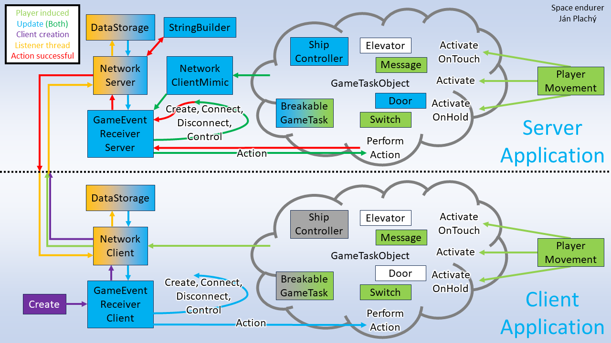

# Space endurer - vývojová dokumentácia

Hra je vytvorená pomocou Unity.
To spôsobuje niektoré drobné odlišnosti v používaní jazyka
oproti klasickému použitiu.
Charakteristické je,
že takmer všetky mnou vyrobené triedy dedia od MonoBehaviour,
vďaka čomu je možné ich pridať na objekty v scéne
a spúšťajú sa na nich metódy charakteristické pre Unity,
na základe rôznych udalostí
(napríklad, Start, Update, OnApplicationQuit, OnDestroy...).
Objekty je možné uložiť ako takzvané Prefabs,
v ktorých je pre konkrétny objekt uložený celý strom jeho detí
aj so všetkými vlastnosťami menenými v editore.
Objektom sa dajú pridať rôzne komponenty,
napríklad collidery alebo meshe,
ale aj scripty, ktoré potom daný objekt používa
(a v tomto texte ich občas zamieňam za objekty samotné).

Unity si veľmi nerozumie s vláknami,
celá hra štandardne beží v jednom vlákne
(ktoré je napríklad pri debugovaní aj vláknom editora),
preto som sa pri návrhu vyhol zamykaniu, ktoré by mohlo spôsobiť
(aj keď len na krátku dobu), že hlavné vlákno bude čakať na iné vlákno,
čím by sa mohol výrazne zhoršiť výkon.

Implementačne je hra rozdelená na serverovú časť a časť pre klienta,
no tieto dve časti majú veľa správania spoločného
a používajú veľa spoločných tried.

## Scény

Hra pozostáva zo štyroch scén:

- Úvodné menu, kde sa dá zadať meno a adresa, na ktorú sa pripojiť,
alebo začať hru ako server.
Tá obsahuje Canvas a ďalšie štandardné UI elementy. Údaje sa kontrolujú pri zadávaní a pokiaľ sú valídne, stlačenie tlačidiel spôsobí prepnutie
do scény pre inicializáciu servera alebo klienta.
Údaje ako adresa a meno hráča sa medzi scénami
(a pri ďalšom zapnutí úvodnej scény) prenášajú pomocou PlayerPrefs.
- Scéna inicializujúca hru servera.
Pri zapnutí scény servera sa vytvorí MenuController,
GameControllerServer a ObjectTypeDictionaryHolder.
Tiež vznikne GameInitializer, ktorý má za úlohu na serveri vytvoriť
hernú mapu so základnými objektami.
- Scéna inicializujúca hru klienta.
Pri zapnutí scény klienta sa vytvorí MenuController,
GameControllerClient a ObjectTypeDictionaryHolder.
Okrem toho sa zobrazí ešte správa s čakaním na odpoveď servera,
ktorá po pripojení zmizne.
- Víťazná obrazovka, kde sa zobrazuje skóre po konci hry
a odkiaľ sa dá prekliknúť na úvodné menu.
Tá sa zobrazí každému hráčovi po skončení hry.

## Triedy

Jednotlivé triedy, ich úlohy a interakcia.

Zjednodušená schéma komunikácie jednotlivých tried:

### Networking

V súbore Networking.cs sú implementované triedy,
ktoré nededia od MonoBehaviour -- SimpleSender a Simple Receiver,
interfacy INetworkSender a INetworkReceiver a štruktúra DataToken.
Nachádzajú sa tam aj pomocné statické funkcie,
ktoré používa sender alebo receiver,
napríklad na zistenie voľného portu či lokálnej
(a potenciálne aj globálnej) IP adresy.

DataToken slúži na predávanie informácií medzi Senderom na jednej strane
a Receiverom na druhej.
V aktuálnej implementácií sa okrem ľubovoľného stringu do tokenu ukladá
aj dátum vytvorenia, ktorý ale nie je použitý na nič.
Preto má celý typ skôr formálnu úlohu zabezpečiť,
aby sa posielali len dáta na to určené, teda také,
ktoré boli najskôr prevedené na DataToken.

Interfacy špecifikujú, čo by mal vedieť robiť Sender a Receiver
(napríklad ak by som sa v budúcnosti rozhodol zmeniť ich implementáciu).
Senderu stačí vedieť iba poslať dáta na určenú adresu,
na štandardnú adresu (ak nie je špecifikovaná konkrétna)
a zadať štandardnú adresu.

Receiver adresu dostane v konštruktore,
preto jej zadanie nie je metóda interfacu.
Musí vedieť začať a skončiť počúvanie, aby bolo možné uvoľniť zdroje
aj pri spúšťaní v Unity editore (musí cielene zabiť počúvajúce vlákno).
Tiež musí vedieť podať informáciu, či práve počúva a na akej adrese.
A v neposlednom rade musí dávať informáciu, či existujú nejaké nové dáta,
ktoré sa z neho dajú získať, a poskytnúť ich.

SimpleSender implementuje interface INetworkSender celkom priamočiaro,
s použitím štandardného HttpClienta.

#### SimpleReciever

Implementuje INetworkReceiver.
Pri spustení vytvorí separátne vlákno,
ktoré pomocou HttpListenera prijíma requesty (a inak na ne čaká),
získava z nich dáta
a tieto umiestňuje do úložiska ConstantCapacityDataStorage.
Zároveň poskytuje možnosť vytiahnuť z tohoto úložiska údaje na požiadanie,
čo sa už deje v hlavnom vlákne spolu so zbytkom aplikácie.

#### ConstantCapacityDataStorage\<TData>

Táto generická trieda (ktorá tiež nededí od MonoBehaviour)
je zodpovedná za presúvanie dát (hodnotového typu)
medzi vláknami tak, že jedno vlákno dáta len vkladá a druhé len vyberá.
Implementuje generický interface IDataStorage.

Je uložená v súbore LockFreeAsyncDataStorage.cs,
kde sú zároveň interfacy pre StoragePusher a StoragePopper
(a implmentácie týchto podtried).
Cieľom tohto návrhu je pripraviť ho na možnosť použitia,
kedy jeden objekt dáta vkladá a iný ich vyberá,
a navzájom k opačnej funkcionalite nemajú prístup.

ConstantCapacityDataStorage zároveň vydá DataPusher aj DataPopper
najviac raz, pri pokuse o ich opätovné vydanie
vyšíri výnimku, aby sa zabránilo dvom rôznym objektom
(potenciálne z dvoch rôznych vlákien) súčasne vkladať
alebo súčasne vyberať dáta, čo by mohlo viesť na race condition
a stratu integrity dátovej štruktúry
(stále je možné to jednoducho docieliť skopírovaním referencií
daných objektov po získaní, ale aspoň by to upozornilo na to,
keby sa niekto pokúsil použiť triedu triviálne zlým spôsobom).

#### NetworkServer a NetworkClient

Tieto dve triedy sú bránou pre komunikáciu zbytku aplikácie
s vyššie uvedenými triedami.
Práve jedna inštancia NetworkServera sa nachádza v scéne pre hru servera,
práve jedna inštancia NetworkClienta sa nachádza v scéne pre hru klienta.
Triedy sú podobné a majú podobný účel,
ale odlišujú sa v detailoch, pretože server má viac úloh.
Obidve spolupracujú s GameEventReceivermi,
jedna s GameEventReceiverServerom, druhá s GameEventReceiverClientom.

NetworkClient má vlastný NetworkSender aj NetworkReceiver,
po vzniku pošle cez Sender správu serveru
(ktorého adresu zistí z PlayerPrefs) o tom, že sa pripája nový klient.
Vo funkcií Update (volanej v každom frame) sa pýta Receivera,
či prišli nové dáta, a ak áno, pošle ich GameEventReceiveru na spracovanie.
Tiež má verejnú metódu, ktorou je možné poslať ľubovoľný GameEvent serveru.
Client tiež spravuje ID hráča, ktoré dostane (nepriamo) pri pripojení.

NetworkServer robí to isté, čo Client, ale eventy posiela všetkým klientom a pred poslaním sa pozrie, či je event označený ako Temporary -- dočasný.
Pokiaľ áno, je to event, ktorý netreba ukladať, pretože sa takmer okamžite
prekryje novým eventom, ktorý ho zneaktuálni, takže aj keby sa nový hráč
pripojil neskôr, nepotrebuje informácie o tom, že tento event prebehol
(napríklad zmena polohy hráča alebo aktualizácia skóre či hladiny kyslíka).
Ak event nie je dočasný,
Server si ho odloží do StringBuildera ako nový riadok.
Keď sa potom pripojí nový hráč, Server mu pošle jeden DataToken
obsahujúci všetky eventy, ktoré doteraz prebehli.
Dôležitá vlastnosť servera je, že všetky dáta, ktoré dostane,
prepošle všetkým aktívnym klientom.
Server tiež udržiava zoznam aktuálne pripojených hráčov a ich ID --
keď sa hráč pripojí, server jeho adresu pridá do zoznamu
a pošle mu zodpovedajúce ID,
keď sa hráč odpojí, nahradí jeho adresu za null
a už mu prijaté dáta neposiela.

Keďže mnoho objektov potrebuje posielať niečo serveru,
ale ich implementácia chce byť rovnaká na serveri aj v klientovi,
potrebujú možnosť, ako so serverom komunikovať,
a rozlišovať to v každej triede by bolo neefektívne a neudržateľné.
Preto existuje NetworkClientMimic, ktorý dedí od NetworkClienta
(aby bol nájditeľný ako NetworkClient funkciami, ktoré ho hľadajú v scéne),
ale všetky poslané dáta predáva rovno GameEventReceiveru,
ako keby boli doručené NetworkServeru.

### GameEventReciever a GameEvent

GameEventReceiver implementuje spoločné metódy pre GameEventReceiverServer
a GameEventReceiverClient, ktoré potom fungujú samostatne na serveri
a v klientovi, každý v práve jednej inštancií.
Dôvod existencie spoločného predka je rovnaký, ako pri NetworkClientovi
a NetworkServerovi, teda aby sa dali dané spoločné metódy používať
objektami, ktoré nerozlišujú, či sú v scéne na serveri alebo v klientovi.
GameEventReceiver dostane z NetworkServera alebo Clienta GameEvent,
ktorý je špecialne zakódovaný,
a podľa jeho typu sa vo funkcií PerformAction rozhodne, čo s ním spraví:

- Connect
  - Server pridá hráča a pošle event o vytvorení jeho postavy.
  Prijatý event musí obsahovať atribúty "ClientAddress" a "PlayerName".
  Posielaný event sa pošle až potom, čo NetworkServer odošle
  novému klientovi jeho pridelené ID a všetky predošlé uložené eventy.
  - Client dostane pridelené ID a uloží si ho.
  Event musí obsahovať atribút "ClientID", ktoré bolo pridelené
- Disconnect
  - Client zničí objekt hráča, ktorého "ObjectID" obsahuje event.
  Ak je zároveň "ClientID" rovné nule, skončil hráč na serveri,
  teda hra bola ukončená na serveri a teda skončí aj v klientovi.
  - Server okrem zničenia objektu hráča ešte zníži počet hráčov,
  ktorý si pamätá.
- Create
  - Client aj Server spracujú event rovnako, Server ho aj prepošle ďalej.
  Event musí obsahovať atribúty "ObjectType", "ObjectPosition",
  "ObjectRotation", pre klienta aj "ObjectID" (server ho pridelí sám).
  Vytvorí sa objekt určeného typu podľa prefabu,
  ktorý obsahuje komponent dediaci od GameTaskObject.
  Ak event obsahuje "ControllerID",
  nastaví sa vytvorenému objektu ID hráča,
  ktorý ako jediný môže daný objekt kontrolovať
  (toto si jednotlivé objekty, pre ktoré je to relevantné, riešia samé),
  napríklad postavy hráčov alebo ShipController
  (kontrolovaný iba serverom). Ak obsahuje "AdditionalInfo",
  aj to sa predá vytvorenému objektu zavolaním metódy AddInfo.
- Action
  - Client zavolá na objekte nájdenom podľa "ObjectID" metódu PerformAction
  a predá jej všetky atribúty. Každý objekt si splnenie akcie rieši sám.
  Každá akcia musí mať atribút "ActionType".
  Action najčastejšie vzniká tak,
  že ho určitý GameTaskObject vytvorí a cez NetworkClient pošle serveru.
  - Server zavolá tú istú metódu, ale uloží si aj jej návratovú hodnotu,
  ktorá vraví, či bola úspešná.
  Ak áno, pošle ju klientom, ktorí ju potom tiež vykonajú.
- Control
  - Tento event spracuje Client aj Server takmer rovnako, buď ide o update
  prejdenej vzdialenosti alebo hladiny kyslíka.
  Ak je hladina kyslíka nulová, hra skončí.

#### Kódovanie GameEventov

Každý GameEvent je po sieti posielaný reprezentovaný jedným riadkom,
ktorý na začiatku obsahuje typ eventu a ďalej atribúty oddelené
bodkočiarkami (";"), ktoré obsahujú dvojice KĽÚČ, dvojbodka (":"),
HODNOTA.
Výnimku tvorí atribút "Temporary", ktorý hosnotu a oddeľovač nemá.

Interne obsahuje GameEvent konkrétny typ eventu, informáciu o tom,
či je dočasný a atribúty uložené ako Dictionary<string, string>.
Pri posielaní sa zmení na textovú reprezentáciu
a pri doručení sa znova sparsuje na internú reprezentáciu.

### GameTaskObject

Všetky herné objekty, s ktorými môže interagovať hráč
alebo dokážu spracovať akciu a vyhodnotiť, či bola úspešná,
majú ako komponent script GameTaskObject alebo jeho potomka.

Fungujú rovnako na serveri aj v klientovi, teda sa správajú,
ako keby boli v klientovi.
Niektoré však vykonávajú určité akcie iba pokiaľ je klient
zároveň hráčom, ktorý ich kontroluje.
Napríklad ShipController alebo BreakableGameTask
vykonávajú určité akcie len u klienta s ID 0, ktorým je vždy server.
Objekty jednotlivých hráčov zase reagujú na vstup
a posielajú svoju pozíciu len u klientov, ktorí za nich hrajú
a u ostatných sa ich pozícia periodicky aktualizuje
podľa informácií od servera.

Každý GameTaskObject má tri public metódy na interakciu,
ktoré podrobnejšie rozoberiem v časti PlayerMovement.

Tiež má metódu PerformAction, ktorú u neho volá GameEventReceiver.
Táto metóda dostane popis akcie ako Dictionary<string, string>
(z GameEventu), pokúsi sa danú akciu spraviť a vráti true alebo false
podľa výsledku, či sa akcia podarila.
GameEventReceiverClient návratovú hodnotu zahodí -- počíta sa s tým,
že akcie, ktoré má vykonať, sa podarilo vykonať na serveri,
teda sa ich podarí vykonať aj v klientovi.
Server podľa danej návratovej hodnoty rozhodne,
či akciu preposlať klientom.

GameTaskObjectu sa tiež dá nastaviť kontrolujúci hráč
a má metódy na odoslanie akcie zmeny svojej polohy a jej spracovanie.
Má tiež metódu AddInfo, ktorá sa volá pri vytváraní,
aby bolo možné predať už pri vytvorení konkrétne informácie.

#### BreakableGameTask

BreakableGameTask má jeden zo štyroch typov:
DoorPanel, OxyGenerator, MotorReactor a WireBox.
Každý z nich má vlastný prefab,
ale zatiaľ sa okrem typu odlišujú iba farbou.

#### SwitchScript, ElevatorScript, DoorScript

#### ShipController

#### MessageScript

### PlayerMovement

Tento script je zodpovedný za pohyb a interakciu hráča s hrou,
ale čiastočne aj za komunikáciu so serverom.

Vstup od uživateľa je riešený kombináciou starého a nového InputSystemu,
pohyb a interakcia sú celé naprogramované tu.
Pri interakcií vie hráč aktivovať jednu z troch metód objektu
typu GameTaskObject,
s ktorým interaguje:

- ActivateOnTouch -- pri dotyku collidera hráča a collidera objektu.
- Activate -- pri stlačení E alebo ľavého tlačidla myši a mierení na objekt
(a dostatočne malej vzdialenosti, vyhodnocuje sa pomocou raycastu).
- ActivateOnHold -- ako Activate, ak je neprerušene držaná určený čas.

V rámci komunikácie so serverom objekt cez klienta
posiela informáciu o odpojení sa
a tiež pravidelné dočasné akcie zmeny svojej polohy.

#### LegsScript a NameScript

LegsScript zodpovedá za zisťovanie, či hráč môže vyskočiť
tým, že počíta collidery, ktorých sa práve "nohy" hráča dotýkajú.

NameScript si na začiatku nájde aktívneho hráča
(teda takého, ktorý sa pohybuje na základe interakcie daného klienta)
a po celý čas sa otáča smerom k nemu,
aby daný hráč videl mená všetkých ostatných.

### UI

#### MenuController

Táto trieda má za úlohu riešiť pauzovanie a ukončovanie hry
a tiež zobrazovanie aktuálnych stavov a adresy servera.
Práve jedna inštancia objektu tejto triedy je v hre prítomná po celú dobu.

Všetky updaty stavu skóre (vzdialenosti) alebo hladiny kyslíka,
ktoré prídu so servera, sa posielajú danému objektu, ktorý ich vypisuje.
Zároveň reaguje na stlačenie tlačidiel na pauzu alebo opustenie hry.
Pri pauze vypne pohyb objektu aktívneho hráča a uzamknutie kurzora
a pri opustení hry spustí u daného hráča odpojenie sa.

#### Ďalšie triedy zodpovedné za UI

Trieda UIController ovláda začiatočné menu,
WinningScreenUI ovláda menu víťaznej obrazovky,
ClientGameUI ovláda nápis, ktorý po pripojení sa klienta zmizne.
Všetky majú jednoduchú implementáciu.
Trieda UIController tiež testuje validitu vstupov mena a adresy.

### ObjectTypeDictionaryHolder

Aby sa dali dvojice názov typu -- typ objektu dobre meniť v editore,
sú ich prefaby uložené v prefabe ObjectTypeDictionaryHolder,
ktorého inštancia existuje v scéne hry servera aj klienta,
a z ktorého je ich potom  možné získať
v prípade potreby vyrobiť nový objekt podľa názvu jeho typu.
Využíva pritom atribúty [Serializable] a [SerializeField]
a ďalšie typy definované v súbore GameEvents.cs.
